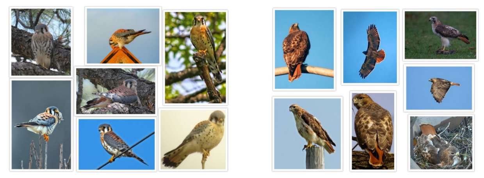
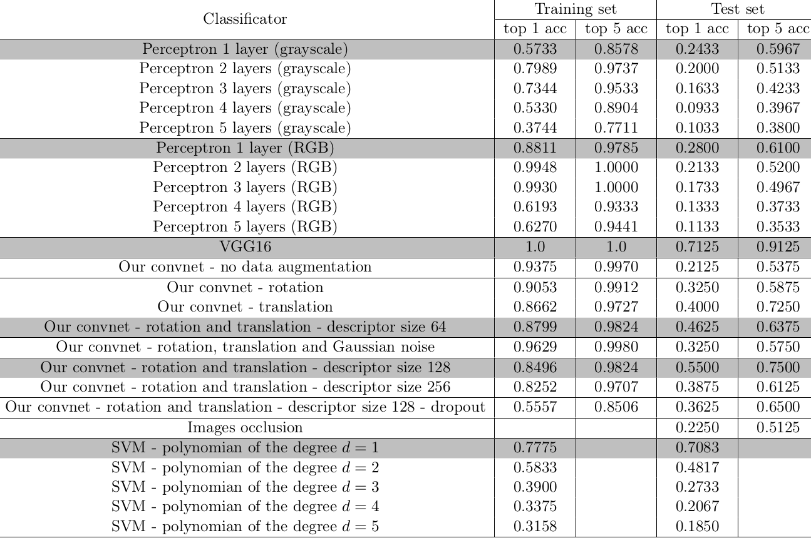

# SNR Project - recognizing birds
The goal of this project was to test different approaches of image classification.

## Dataset
* 3000 images of birds
* 50 classes
* different resolutions
* images in sRGB color space
* JPEG files
* whole dataset - 600MB

Example images


## Experiments
The project was divided into 4 parts:
1. BSIF features and perceptron
    - constant number of neurons, dividing them into 1-5 layers
2. VGG16 with imagenet weights and finetuning on our data
3. Our architecture proposition trained using data augmentation
    - rotation (-5°,+5°)
    - translation (-30, +30 in x and y)
    - rotations + translations
    - add noise
    - add dropout
    - try early stopping
    - different descriptor sizes
4. SVM on features extracted from our network

## Results


## Setup
We're providing requirements.txt file, which can be used to prepare environment using virtualenv on conda

**conda**
```bash
conda create --name birds python=3.6
source activate birds
conda install --yes --file requirements.txt
```
**virtualenv**
```bash
virtualenv --python=/path/to/python3.6 birds
source birds/bin/activate
pip install -r requirements.txt
```

You need to install octave package:
```bash
sudo apt-get octave liboctave-dev
octave-cli
pkg install -forge image
```
## Perceptron
Put SET_A and bounding_boxes.txt in data directory

```bash
# from preprocess directory
python extract_birds_using_bounding_boxes.py

# from BSIF - compute BSIF features for images
octave-cli bsif_maker.m
python mat2csv.py bsifhistnorm_features_gray_cube.mat > bsifhistnorm_features_gray_cube.csv
octave-cli bsif_maker_rgb.m
python mat2csv.py bsifhistnorm_features_rgb_cube.mat > bsifhistnorm_features_rgb_cube.csv

# from src
python perceptron_experiment.py
```

## VGG16 finetuning
- train_convnet.py
   ```
   usage: train_convnet.py [-h] [-train TRAIN] [-test TEST] [-history HISTORY]
                        [-model MODEL]

   Finetune VGG16

   optional arguments:
   -h, --help        show this help message and exit
   -train TRAIN      Path to train data
   -test TEST        Path to test data
   -history HISTORY  File where to store history
   -model MODEL      File where to store model
   ```

## Our network training
- our_net.py
   ```
   usage: our_net.py [-h] [-train TRAIN] [-test TEST] [-history HISTORY]
                  [-model MODEL] [-noise] [-desc_size DESC_SIZE]
                  [-dropout DROPOUT]

   Train our network

  optional arguments:
  -h, --help            show this help message and exit
  -train TRAIN          Path to train data
  -test TEST            Path to test data
  -history HISTORY      File where to store history
  -model MODEL          File where to store model
  -noise                Add noise to training images
  -desc_size DESC_SIZE  Descriptor size
  -dropout DROPOUT      Add dropout

   ```

## SVM
- compute_cnn_features.py
   ```
  usage: compute_cnn_features.py [-h] -m M -i I

  Compute CNN features from last layer

  optional arguments:
  -h, --help  show this help message and exit
  -m M        Path to model
  -i I        Dir containig images for features computation
   ```

- svm.py
   ```
  Train SVM classifier

  optional arguments:
  -h, --help  show this help message and exit
  -i I        Path to data
  -r R        Train/Test split ratio
   ```


## Preprocessing scripts

- add_overrite.py - draws random rectangle on every image from dir
    ```
    usage: add_override.py [-h] [-i I]

    Add random black rectangle for every file in input dir.

    optional arguments:
    -h, --help  show this help message and exit
    -i I        Input dir
    ```

- extract.py - script for crop extraction using bounding boxes and for static data argumentation
    ```
    usage: extract.py [-h] [-i I] [-b B] [-o O] [-f] [--translate TRANSLATE]
                    [--rotate ROTATE] [--translate-rotate TRANSLATE_ROTATE]
                    [--debug] [--square] [--noise]

    Bounding box extraction and data argumentation.

    optional arguments:
    -h, --help            show this help message and exit
    -i I                  Input dir
    -b B                  Bounding boxes file
    -o O                  Output dir
    -f                    Force overwrite
    --translate TRANSLATE
                            How many times to do translate argumentation
    --rotate ROTATE       How many times to do rotate argumentation
    --translate-rotate TRANSLATE_ROTATE
                            How many times to do translate + rotate argumentation
    --debug               Debug mode
    --square              Crop square
    --noise               Add noise

    ```
- spilt_train_test.py - moves files from input dir to output and splits them between train and test dirs using ratio argument
    ```
    usage: split_train_test.py [-h] [-ratio RATIO] [-i I] [-o O]

    Split data between test and train sets by ratio.

    optional arguments:
    -h, --help    show this help message and exit
    -ratio RATIO  Train/test size ratio
    -i I          Input dir
    -o O          Output dir

    ```
